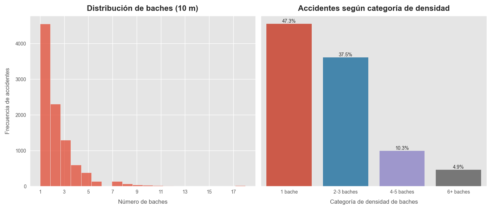
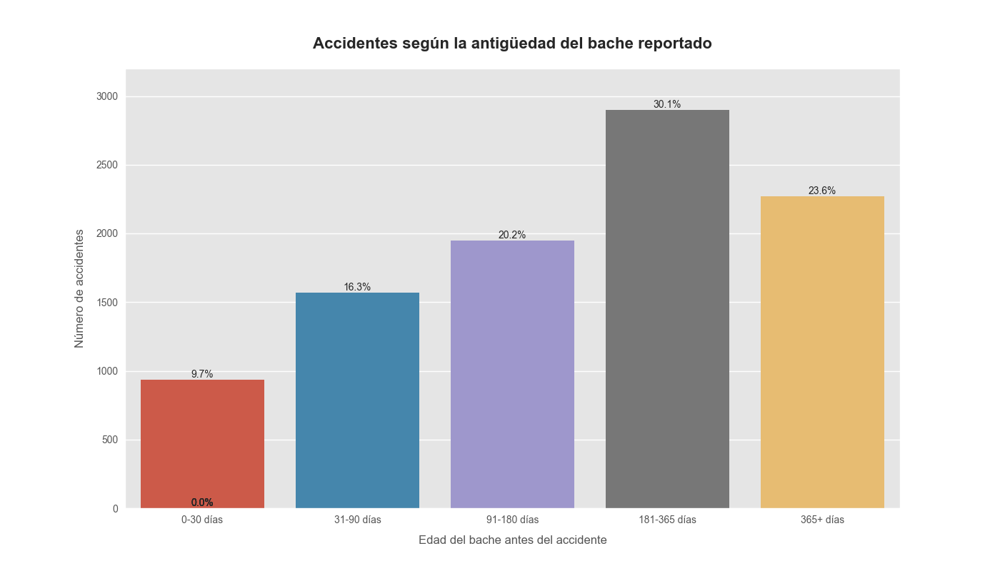
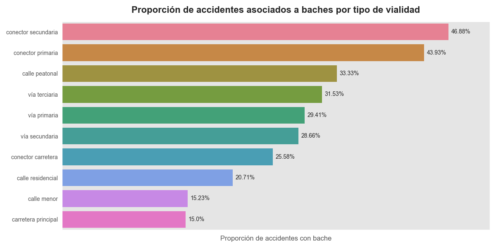
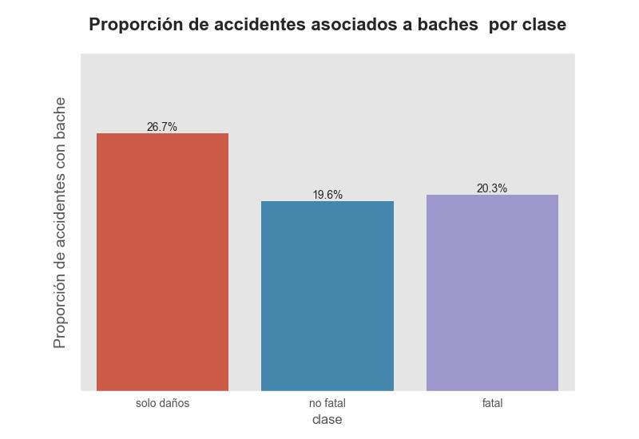

# **Reporte Atus-Vialidad-Bachometro**

El presente reporte resume los principales hallazgos de la libreta [`eda-atus-vialidad-baches.ipynb`](../notebooks/2.3-eda-atus-baches-vialidades.ipynb), cuyo objetivo es analizar si existe una relación entre la presencia de **baches** y la **ocurrencia de accidentes viales** en la ciudad de Hermosillo, Sonora. Para ello, se integraron los datos de *Accidentes de Tránsito Terrestre en Zonas Urbanas y Suburbanas (ATUS)* con información georreferenciada del **Bachómetro**, permitiendo identificar para cada accidente la presencia, proximidad y la antigüedad de baches reportados.  

El análisis se desrrolló bajo un enfoque descriptivo, utilizando únicamente los accidentes y baches que pudieron ser asociados espacialmente. Se generaron métricas como densidad de baches alrrededor del accidente, tiempo transcurrido desde el reporte del bache más cercano hasta la ocurrencia del accidente y caracterpsiticas de la vialidad donde ocurrieron los eventos. 

Debido a la naturaleza de los datos, **no es posible establecer causalidad**; sin embargo, sí se identifican **patrones consistentes** en la ocurrencia espacial y temporal entre vaches y accidentes, los cuales aportan información relevante para la planeación de mantenimiento vial y la toma de desiciones. 

En las siguientes secciones se presentan los resultados más relevantes, enfocados en responder las preguntas: 

1. ¿Ocurren más accidentes en zonas con baches?

2. ¿Importa cuánti tiempo lleva sin reportarse un bache?

3. ¿Influye el tipo de vialidad?

4. ¿La severidad del accidente se relaciona con la presenci de baches?

## **0. Datos y limitaciones**

Antes de presentar los resultados, es importante describir brevemente las fuentes de información utilizadas, las transformaciones aplicadas y las principales limitaciones que influyen en la interpretación.

### **Fuentes de datos**

El análisis integra tres conjuntos de datos:

* **Accidentes de Tránsito en Zonas Urbanas y Suburbanas (ATUS)** - INEGI.
  Contiene accidentes georreferenciados ocurridos en Hermosillo durante 2021–2023, con fecha, hora, severidad, tipo de vehículo, lesionados y otros atributos.

* **Baches reportados en Hermosillo** — Bachómetro.
  Incluye reportes ciudadanos con fecha de reporte, fecha de atención y ubicación aproximada del bache.

* **Red de Vialidades Urbanas** — OpenStreetMap (OSM), obtenida con *OSMnx*.
  Proporciona geometría de los segmentos de vialidad y atributos complementarios (tipo de vialidad, número de carriles, velocidad máxima, etc.).

Los datos fueron **filtrados y estandarizados** para representar únicamente la zona urbana de Hermosillo entre 2021 y 2023.

### **Integración y transformaciones**

#### **1. Asociación accidente–vialidad**

Se utilizó `sjoin_nearest` para asignar a cada accidente el **segmento de vialidad más cercano**, junto con sus atributos. Este procedimiento no garantiza coincidencia exacta punto–segmento, pero es el mejor método disponible para ubicaciones donde existen imprecisiones de georreferenciación.

#### **2. Asociación accidente–bache**

Este proceso requirió mayor cuidado debido a la **imprecisión en la ubicación de los reportes** del Bachómetro.

Para cada accidente:

1. Se filtraron únicamente **baches activos** (reportados y no reparados antes del accidente).

2. Se identificaron los baches dentro de un radio de **10 metros**.

3. Se asignó al accidente el conjunto de baches encontrados y se generaron métricas asociadas.

A partir de esta integración se crearon las siguientes variables:

* **dist_bache_min_m** – distancia mínima al bache activo más cercano.

* **bache_cercano_Xm** – presencia (`False`/`True`) de baches en radios específicos (10, 15, 20 30 metros).

* **baches_geom_Xm** – ubicaciones de baches dentro del radio.

* **dens_baches_Xm** – cantidad de baches alrededor del accidente dentro del radio.

* **bache_previo_dias** – días transcurridos entre el reporte del bache más cercano y la fecha del accidente.

##### **Justificación del radio de 10 metros**

El análisis se realiza considerando únicamente los accidentes con baches activos a una distancia de 10 metros. 

La distancia de 10 metros **no fue seleccionada arbitrariamente**.
Durante la exploración espacial se observó que:

* Muchos reportes del Bachómetro **no coinciden exactamente con la vialidad**, debido a que la ubicación depende de donde el usuario tomó la foto o de la posición GPS aproximada.

* Algunos baches aparecen dentro de lotes, edificios o zonas sin vialidad, pese a estar asociados a una calle.

* Al analizar la distribución de distancias entre accidentes y baches activos (sin considerar outliers), encontramos que:

  * **El 25% de los accidentes tienen un bache activo a 7 metros o menos.**

Con base en ello, se adoptó un radio de **10 metros** como margen razonable que:

* Incluye reportes cuya ubicación es aproximada.

* Reduce el riesgo de asociar baches que realmente no están vinculados con el accidente.

* Mantiene un criterio uniforme en todo el análisis.

### **Qué NO se puede afirmar**

Debido a que los datos fueron obtenidos mediante observación, no controlados y provienen de reportes ciudadanos:

* **No es posible afirmar causalidad** (es decir, no podemos concluir que un bache *causó* un accidente).

* No se puede estimar el riesgo real ni el impacto directo del mantenimiento vial sobre los accidentes.

* No se observan todos los baches existentes, solo los **reportados**, lo cual introduce sesgos.

### **Principales limitaciones del análisis**

1. **Imprecisión geográfica en los reportes de baches**: muchos puntos no coinciden exactamente con la ubicación real, lo cual ruido en el análisis.

2. **Alto porcentaje de valores nulos** en atributos importantes de la vialidad, como **número de carriles** o **velocidad máxima**, con ausencias del 70–80%, lo que limita el análisis.

3. **Segmentación vial limitada**: los accidentes se asocian a un solo tramo vial cuya extensión no necesariamente representa toda la vialidad donde ocurre el evento.

5. **Fechas de cierre no confiables** en los reportes de baches: no garantizan que la reparación haya ocurrido en esa fecha o que realmente se haya hecho.

6. **Falta de información contextual**: no se incluyen condiciones reales de **tráfico, iluminación, ó clima**, factores que pueden influir en la ocurrencia de accidentes.

A pesar de estas limitaciones, el análisis permite identificar **tendencias consistentes** que muestran cómo ciertos tipos de vialidades presentan tanto **mayor concentración de baches** como **mayor incidencia de accidentes**, lo que aporta una base sólida para la priorización de mantenimiento y estrategias de mitigación.

## **1. Descripcion general**

En el periodo 2021-2023 se registraron +36000 accidentes con información georreferenciada. Al analizar la presencia de baches en distintos radios alrededor de cada evento, se obtiene lo siguiente:

|    |   Radio (m) |   Total Acc. con Baches |   Proporción (%) |   Densidad Promedio Baches |   Stdev de Baches |
|---:|------------:|------------------------:|-----------------:|---------------------------:|------------------:|
|  0 |          10 |                    9619 |               27 |                       0.64 |              1.35 |
|  1 |          15 |                   11361 |               31 |                       0.64 |              1.35 |
|  2 |          20 |                   12657 |               35 |                       0.77 |              1.57 |
|  3 |          30 |                   14795 |               41 |                       1.05 |              2.03 |

* **27% de los accidentes** tienen al menos un bache a 10 metros de distancia, con una **densidad promedio de 0.64** y **desviación estándar de 1.35 baches por accidente**.

* A **30 metros**, la proporción aumenta a 41%, con una densidad promedio de **1.05** y desviación estándar de **2.03**.

* Estas cifras sugieren que los accidentes tienden a concentrarse en **zonas con presencia de baches** o donde la condición del pavimento es deficiente.

**Si los baches estuvieran distribuidos aleatoriamente** con respecto a los accidentes, esperaríamos proporciones mucho menores —debido al área pequeña que cubre un radio de 10–30 m—. En contraste, observamos que entre **27%** y **41%** de los accidentes presentan baches cercanos, lo que sugiere **una relación espacial no aleatoria**.

## 2. ¿Ocurren más accidentes cerca de baches?

Los siguientes gráficos permiten visualizar **la distrobución del total baches activos existen alrededor de accidentes**:

  

* **Entre el  70-75% de los accidentes ocurren en zonas con 1-3 baches activos**, lo que indica que los eventos no son distribuidos al azar, si no que tienden a presentarse en áreas con deterioro vial. 

* Exsiten casos extremos (hasta 18 baches), pero son poco frecuentes. 

* Aunque este patrón muestra **coincidencia espacial consistente**, no implica que los baches causen accidentes, simplemente que ambas problemáticas ocurren en los mismos entornos. 

## 3. ¿Los accidentes ocurren cuando un bache lleva días sin atenderse? 

Para evaluar si la **antigüedad del bache** se relaciona con los accidentes, se clasificaron los eventos según los días que el bache llevaba activo al momento del accidente. Esto permite observar si los accidentes tienden a ocurrir cerca de baches **recién reportados** o, por el contrario, alrededor de baches **que han permanecido largos periodos sin reparación**.

La siguiente gráfica muestra la distribución de accidentes según la edad del bache más cercano (radio 10 m). 

  

* **Los accidentes son menos frecuentes alrededor de baches recién reportados (0-30 días) y aumentan progresivamente conforme pasa el tiempo.**

* Solo el **9.7%** de los accidentes se vinculan a baches con menos de 30 días de antigüedad. En contraste, más del **53%** de los accidentes ocurren alrededor de baches con más de 180 días sin reparación.

    + Esto sugiere que **la permanencia prolongada de un bache incrementa su contribucuón al riesgo de accidentes**, por lo que la atención temprana podría tener impacto preventivo significativo. 

## 4. ¿La vialidad influye en la relación accidente-bache?

### 4.1 Análsis por vialidades específicas 

Para identificar tramos con alta coincidencia entre baches y accidentes, se analizaron las vialidades con el mayor número de accidentes. 

El objetivo es observar **qué tan frecuente es que un accidente ocurra en presencia de baches**, y si algunas vialidades presentan **proporciones anómalamente altas** que sugieran problemas de mantenimiento. 

Esta aproximación permite distinguir entre: 

* **vialidades con alto volumen de accidentes pero baja proporcion de baches** y

* **vialidades donde los baches parecen tener un papel más relevante**, al presentar proporciones superiores al 40-50%. 

|     | nombre_vialidad                    |   n_accidentes |   n_accidentes_bache |    prop |   densidad_media_baches |
|-----|------------------------------------|----------------|----------------------|---------|-------------------------|
| 193 | boulevard solidaridad              |           3013 |                  788 | 26.1533 |                 2.43655 |
| 153 | boulevard antonio quiroga          |            706 |                  336 | 47.5921 |                 2.95238 |
| 187 | boulevard progreso                 |            724 |                  293 | 40.4696 |                 4.27986 |
| 170 | boulevard josé maría morelos norte |            869 |                  291 | 33.4868 |                 1.56701 |
| 169 | boulevard jesús garcía morales     |            669 |                  240 | 35.8744 |                 2.64167 |
| 183 | boulevard olivares                 |            357 |                  207 | 57.9832 |                 3.11111 |
| 176 | boulevard luis encinas johnson     |            382 |                  206 | 53.9267 |                 2.86408 |
| 178 | boulevard lázaro cárdenas          |            409 |                  169 | 41.3203 |                 2       |
| 211 | calle de la reforma                |            391 |                  157 | 40.1535 |                 2.00637 |
| 140 | avenida xolotl                     |            256 |                  155 | 60.5469 |                 2.85806 |

* El Boulevard Solidaridad es la vialidad con mayor cantidad de accidentes con baches

    * 3013 accidentes, de los cuales 788 (~26%) ocurrieron cerca de baches. 

* El Boulevard Olivares y Boulevard Luis Encinas Jonhson presentan proporciones más altas de accidentes con baches. 

    * Ambas vialidades superan el 50% proporción de accidentes con baches, es decir, uno de cada dos accidentes ocurre en zonas con baches presentes. 

* Las densidades más altas son:

    * Boulevard Progreso: 4.28

    * Boulevard Olivares: 3.11

    * Boulevard Antonio Quiroga: 2.95

* Las principales vialdiades de la ciudad muestran una presencia significativa de accidentes en zonas con baches presentes. Esto sugiere que el deterioro de las vialidades es un factor relevante en la ocurrencia de accodentes, especialmente en tramos donde la densidad de baches es alta. 

### 4.2 Análisis por tipo de vialidad

El siguiente gráfico muestra la proporcion de accidentes con baches respecto al total por tipo de vialidad: 

  

* Los datos sugieren que **no son las vialdiades con más tráfico las que muestran mayor riesgo por baches**, sino las **vialdiades secundarias y de enlace**, posiblemente por menor frecuencia de reparaciones y menor supervición. 

* **Los accidentes relacionados con baches se concentran proporcionalmente en vialidades de menor jerarquía (conectores y vías terciarias). Estas deberían de ser priorizadas en programas de mantenimiento, pues combinan alta presencia de baches con un riesgo más elevado de accidentes**. 

## 5. ¿La presencia de baches está relacionada con mayor severidad?

El siguiente gráfico muestra la proporción de accidentes con baches respecto al total por clase: 

  

* Los accidentes con *solo daños* muestran una porporción ligeramente mayor de ocurrencias cerca de un bache (~30%) en comparación con los accidentes *no fatales* y *fatales*, que precentan proporciones similares (20%). Esto sugiere que, aunque los baches están asociados a accidentes en general, **no parecen incrementar la gravedad** del accidente; más bien , su presencia se distribuye de forma parecida entre eventos *no fatales* y *fatales*.

## 6. Conclusiones

El análisis realizado muestra patrones **consistentes y no aleatorios** entre la presencia de baches y la ocurrencia de accidentes en Hermosillo. Aunque los datos utilizados no permiten establecer causalidad directa, sí ofrecen evidencia sólida de que los baches **forman parte del entorno vial donde ocurren una proporción considerable de accidentes**, y que su permanencia prolongada podría estar relacionada con mayores niveles de riesgo.

En conjunto, los resultados permiten concluir lo siguiente:

#### **1. Existe una asociación espacial clara entre accidentes y baches.**

Entre 27% y 41% de los accidentes presentan baches activos en un radio de 10–30 m, una proporción elevada considerando el área tan pequeña que cubren dichos radios. Esto sugiere que los accidentes **no se distribuyen aleatoriamente** respecto a la ubicación de los baches, sino que ambos eventos tienden a concentrarse en los mismos entornos viales.

#### **2. Los accidentes tienden a ocurrir cerca de baches con mayor antigüedad.**

Más del 50% de los accidentes asociados ocurren alrededor de baches con más de 180 días sin reparación. Aunque esto no implica causalidad directa, sí indica que los baches **más antiguos y persistentes** son los que con mayor frecuencia coinciden con accidentes, lo cual es relevante para políticas de mantenimiento preventivo.

#### **3. Algunas vialidades muestran proporciones anormalmente altas de accidentes con baches.**

Vialidades como **Boulevard Olivares, Luis Encinas Johnson y Antonio Quiroga** presentan proporciones superiores al 50%. Esto sugiere que el **deterioro de la vialidad** podría estar interactuando con condiciones propias de cada tramo (tráfico, geometría,velociadad máxima, número de carriles), reforzando la hipótesis de que los baches son un elemento de riesgo en vialidades específicas.

#### **4. La evidencia por tipo de vialidad indica que el problema no se concentra en las vialidades principales.**

De hecho, las **vialidades secundarias y terciarias** presentan las mayores proporciones de accidentes con baches. La coincidencia entre deterioro vial y accidentalidad parece ser más marcada en estas vías de menor jerarquía, lo que sugiere que los programas de mantenimiento podrían tener un impacto significativo si priorizan estos tramos.

#### **5. La asociación entre baches y la severidad del accidente es débil.**

Las proporciones son similares entre accidentes no fatales y fatales, y ligeramente mayores en accidentes con solo daños. Esto indica que, aunque los baches coinciden espacialmente con los accidentes, **no se observa un patrón sólido que los vincule con mayor severidad** del evento.

---

Aunque el análisis no permite afirmar que los baches *causen* accidentes, sí muestra que los baches —especialmente aquellos con alta permanencia y localizados en vialidades secundarias— conforman un **entorno asociado de manera sistemática** con una fracción relevante de los accidentes viales en Hermosillo. Esto convierte al mantenimiento oportuno del pavimento en una **estrategia plausible y potencialmente efectiva** para reducir riesgos, particularmente en las vialidades donde la coincidencia bache–accidente es más marcada.
